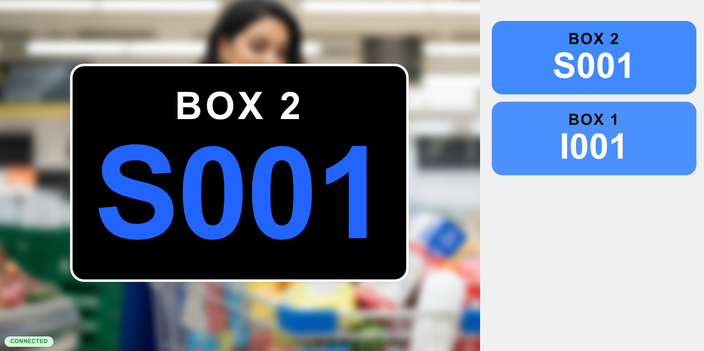
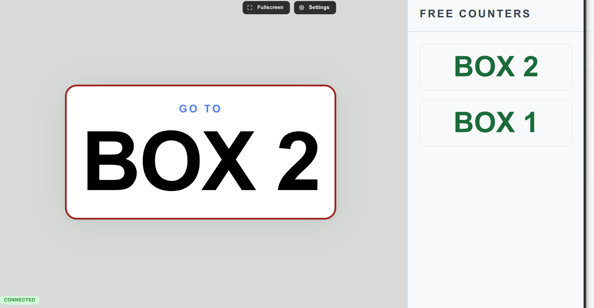
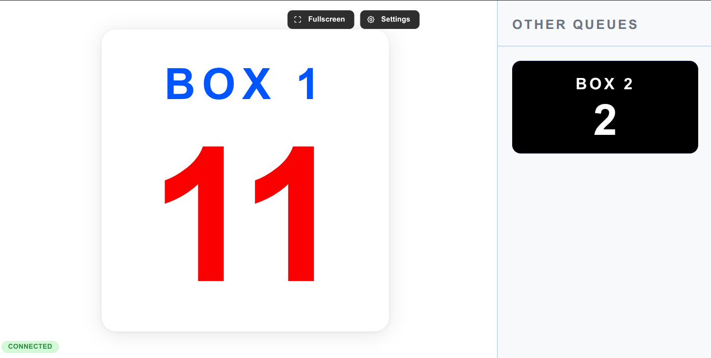
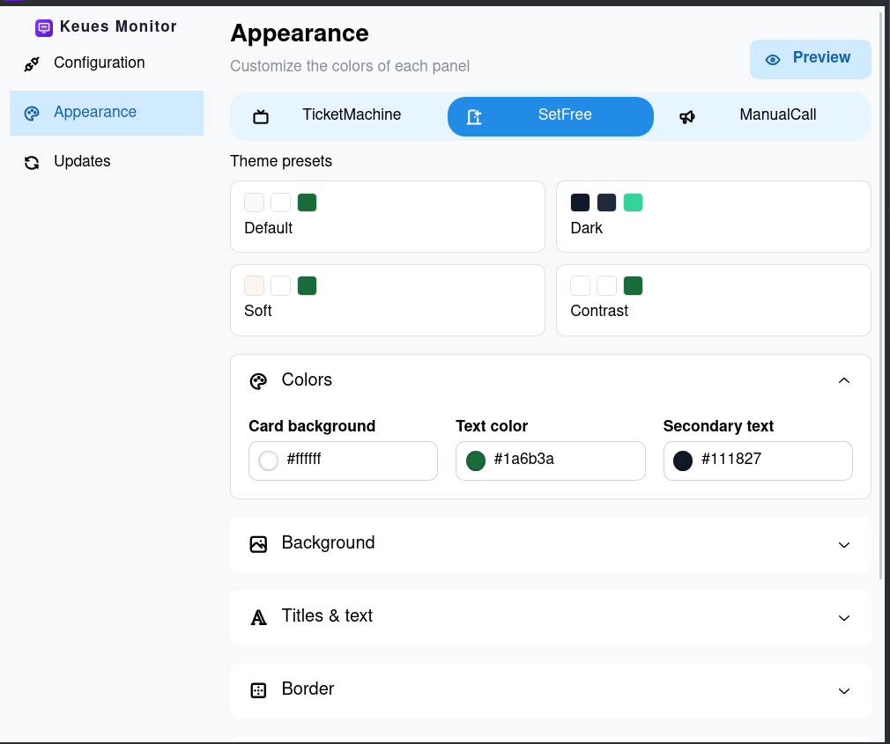

# Keues Monitors

[](https://github.com/HastaCs/Keues-Monitors)
[](https://github.com/HastaCs/Keues)
[](https://tauri.app/)
[](https://react.dev/)
[](https://www.typescriptlang.org/)
[](https://vite.dev/)
[](https://mantine.dev/)
[](LICENSE)

> [English](README.md)

Pantallas de TV para el sistema de gestión de colas [Keues](https://www.keues.dev).

Keues Monitors es la aplicación que se ejecuta en las **pantallas de monitor** (TVs de sala) de un establecimiento (carnicería, pescadería, supermercado, etc.). Muestra a los clientes, en tiempo real, lo que ocurre en la cola: el turno que se está llamando ahora mismo, el último puesto que ha quedado libre, el número de llamada manual y un histórico de últimas llamadas.

Es de **solo lectura**: únicamente muestra información, nunca escribe en el backend.

> ⚠️ Este proyecto no funciona de forma independiente. Necesita el backend de [Keues](https://github.com/HastaCs/Keues) (API REST + hub SignalR) para conectarse y mostrar datos.

---

## Capturas de pantalla

<table align="center">
  <tr align="center">
    <td>
      
      <br/><b>TicketMachine</b> — turno actual + historial
    </td>
    <td>
      
      <br/><b>SetFree</b> — puesto libre
    </td>
  </tr>
  <tr align="center">
    <td>
      
      <br/><b>ManualCall</b> — llamadas manuales
    </td>
    <td>
      
      <br/><b>Apariencia</b> — personalización del panel
    </td>
  </tr>
</table>

---

## Cómo funciona

Cada monitor se ejecuta en una pantalla del establecimiento:

1. Elige el **servidor**, una **ubicación** y un **flujo**.
2. Asigna un **nombre** a la pantalla para identificar la TV.
3. El monitor se conecta al backend (SignalR) y muestra el panel correspondiente al tipo de flujo.

Un monitor **no está vinculado a un puesto concreto**: muestra la actividad de toda la ubicación/flujo elegida.

El tipo de flujo determina el panel que se muestra:

| Tipo de flujo | Panel | Qué muestra |
|---|---|---|
| `0` — TicketMachine | TicketMachine | Turno actual en grande + últimos turnos llamados con su puesto |
| `1` — SetFree | SetFree | Último puesto libre en grande |
| `2` — ManualCall | ManualCall | Número de llamada manual, p. ej. `P-78` (grande) + llamadas de otras colas |

---

## Características

### Apariencia totalmente personalizable

Cada panel se puede personalizar **por tipo de flujo** (TicketMachine, SetFree y ManualCall guardan su propia configuración):

- **Colores**: fondo, tarjetas, texto principal/secundario, título y todo el panel de histórico.
- **Imagen de fondo**: sube tu propio fondo de pantalla.
- **Borde**: color y grosor de la tarjeta principal.
- **Textos editables**: título principal, texto del pie ("Pase al puesto"), cabecera del histórico y más.
- **Panel de histórico**: muéstralo u ocúltalo, y personaliza sus colores de forma independiente.

### Voz humana opcional en SetFree

El panel **SetFree** puede anunciar por voz el puesto libre (opcional). Puedes:

- Activar o desactivar el anuncio de voz por pantalla.
- Elegir la voz (español o inglés) entre las voces neuronales integradas.
- Definir un texto personalizado que se lee justo antes del código del puesto (p. ej. *"Pase al mostrador"*).
- El anuncio solo se reproduce cuando el puesto aparece realmente en pantalla.

### Tiempo real y fiabilidad

- **Actualización en tiempo real** vía SignalR con reconexión automática.
- **Modo pantalla completa** para TVs (los controles en pantalla se ocultan automáticamente).
- **Configuración persistente**: el ajuste se guarda localmente y se restaura en cada arranque.
- **Solo lectura**: el monitor nunca llama a endpoints de escritura.

---

## Instalación y ejecución

```bash
pnpm install
pnpm start
```

- `pnpm start` arranca Vite (renderer en `http://localhost:11225`) y la ventana de Tauri a la vez.
- En el primer arranque se abre la pantalla de configuración (URL del servidor, ubicación, flujo, nombre de pantalla).

> Para compilar/ejecutar Tauri en Linux se necesitan los paquetes `-dev` (libwebkit2gtk-4.1-dev, libgtk-3-dev, …) y la toolchain de Rust.

---

## Build (Windows)

```bash
pnpm dist
```

Compila el renderer y el backend de Tauri (Rust) y empaqueta un instalador NSIS de Windows mediante `tauri build`.

> **Instalador de Windows:** cada [release de GitHub](https://github.com/HastaCs/Keues-Monitors/releases) incluye un `.exe` listo para instalar en Windows. Descárgalo, ejecútalo y sigue los pasos del instalador — no necesitas herramientas de compilación.

---

## Resumen técnico

### Stack

Tauri 2 · React 19 · Vite 8 · TypeScript 6 · Mantine 9 · @microsoft/signalr.

### Endpoints de la API usados (solo lectura)

| Endpoint | Propósito |
|---|---|
| `GET /api/locations` | Lista de establecimientos |
| `GET /api/flows?locationId=X` | Lista de flujos de una ubicación |
| `GET /api/flows/{id}` | JSON del flujo al día |
| `GET /api/counters?locationId=X` | Puestos, para resolver nombres en los eventos |
| `GET /api/tickets?locationId=X` | Recuperación inicial de turnos actuales (tipo de flujo 0) |

### Eventos SignalR

El monitor se conecta al hub `/devices?...&type=Monitor`. Un único evento, `TicketCalled`, alimenta los tres paneles; `TicketAttended` elimina un turno atendido. `CounterFree` y `ManualCall` están reservados (el backend aún no los emite).

### Estructura del proyecto

```
src-tauri/
  src/
    main.rs          # Almacén de config, UUID deviceId, destino del proxy, comandos TTS
    proxy.rs         # Reverse-proxy local HTTP+WebSocket (evita CORS/mixed content)

src/
  main.tsx           # Punto de entrada, provider de Mantine
  App.tsx            # Carga config → MonitorPanel o ConfigScreen
  api/               # Llamadas REST de solo lectura + servicio SignalR + bridge TTS
  components/
    config/          # ConfigScreen (Configuration / Appearance / Updates)
    monitors/        # MonitorPanel + paneles Ticket/SetFree/ManualCall
  types/             # Definiciones de config, modelos, temas y TTS
```

---

## Licencia

Publicado bajo la [Licencia MIT](LICENSE).
